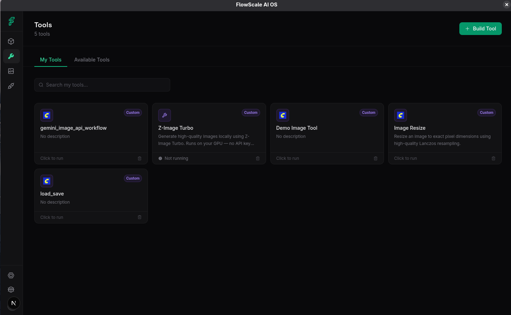
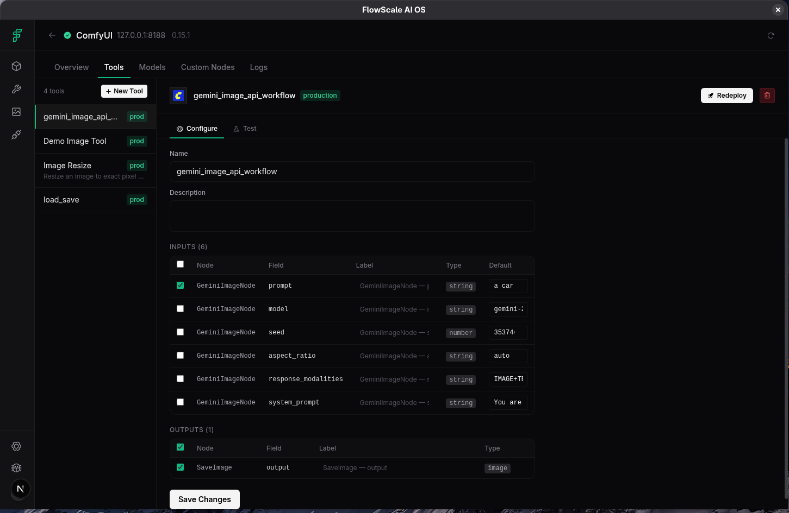
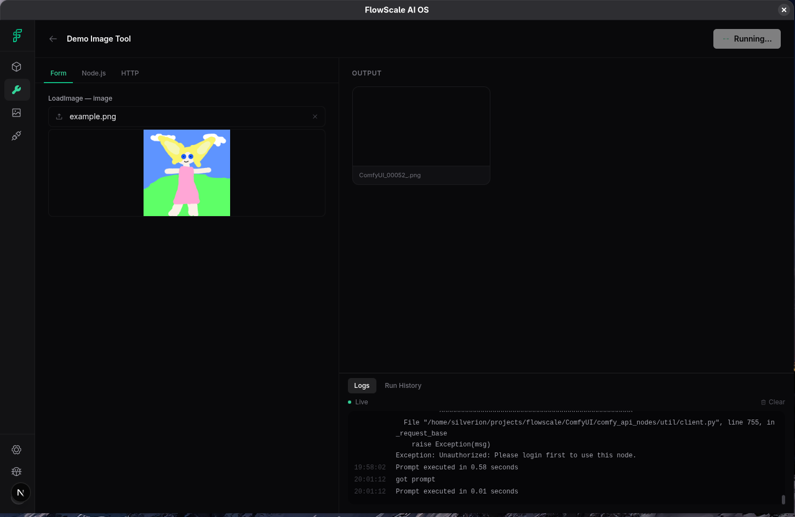
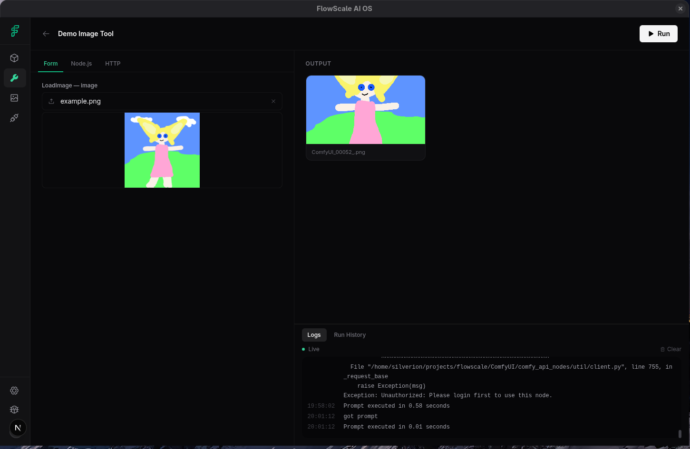

# How to build an app using Tools

This guide covers building apps that run on top of FlowScale AIOS using our Official Node.js SDK.

> For full technical details and advanced usage, reference the main SDK documentation here:
> [packages/sdk/README.md](packages/sdk/README.md)

---

## Installation

```bash
npm install @flowscale/sdk
```

## Authentication

Every request requires a session. Call `login()` once to get a token, then pass it to `createClient()`.

```ts
import { login, createClient } from '@flowscale/sdk'

// 1. Authenticate to get a session token
const token = await login({
  baseUrl: 'http://localhost:14173',
  username: 'admin',
  password: 'your-admin-password',
})

// 2. Initialize the client
const client = createClient({
  baseUrl: 'http://localhost:14173',
  sessionToken: token,
})
```

## Listing tools

Fetch all deployed flowscale tools that are ready to run:

```ts
const tools = await client.tools.list()

for (const tool of tools) {
  console.log(tool.id, tool.name)
  // Example: "demo-image-tool-id", "Demo Image Tool"
}
```



## Inspecting Inputs

Each tool has a `schemaJson` mapping out what inputs it requires. Input keys are always formatted as **`"${nodeId}__${paramName}"`**.

```ts
const tool = await client.tools.get('demo-image-tool-id')
const schema = JSON.parse(tool.schemaJson)

const inputs = schema.filter(f => f.isInput)
for (const field of inputs) {
  console.log(`Key: ${field.nodeId}__${field.paramName}`) // e.g. "6__text"
  console.log(`Type: ${field.paramType}`)                 // e.g. "string"
}
```



## Running a tool

Run a tool by passing the required input keys. `tools.run()` will block and automatically poll the server until the generation is complete.

```ts
const result = await client.tools.run('demo-image-tool-id', {
  '6__text': 'a photorealistic cat on the moon',
  '5__width': 1024,
  '5__height': 1024,
})

// Output paths are relative URLs
for (const output of result.outputs) {
  const fullUrl = client.resolveUrl(output.path)
  console.log(`Generated ${output.kind}:`, fullUrl)
}
```




## Progress Callbacks

If you want to track generation progress (useful for long ComfyUI jobs):

```ts
const result = await client.tools.run('demo-image-tool-id', inputs, {
  onProgress: (status) => {
    // status will be 'running', 'completed', 'failed', or include progress %
    console.log('[progress]', status)
  }
})
```

## Full Example: Express backend

Here is a simple Node.js Express server that wraps a FlowScale tool inside its own API endpoint.

```ts
import express from 'express'
import { login, createClient } from '@flowscale/sdk'

const app = express()
app.use(express.json())

const BASE = 'http://localhost:14173'
let client: Awaited<ReturnType<typeof createClient>> | null = null

async function getClient() {
  if (!client) {
    const token = await login({ baseUrl: BASE, username: 'admin', password: 'password' })
    client = createClient({ baseUrl: BASE, sessionToken: token })
  }
  return client
}

app.post('/generate', async (req, res) => {
  try {
    const { prompt } = req.body
    const c = await getClient()

    // Run the specified FlowScale tool
    const result = await c.tools.run('your-tool-id', {
      '6__text': prompt,
    })

    // Resolve the output paths to full absolute URLs
    const urls = result.outputs.map(o => c.resolveUrl(o.path))
    res.json({ urls })

  } catch (err) {
    res.status(500).json({ error: err.message })
  }
})

app.listen(3000, () => console.log('Server running on port 3000'))
```

---

*Looking for a frontend example? Check out the [aios-sample-app](aios-sample-app) included in this repository to see how to authenticate and render UI elements like images directly in React.*
