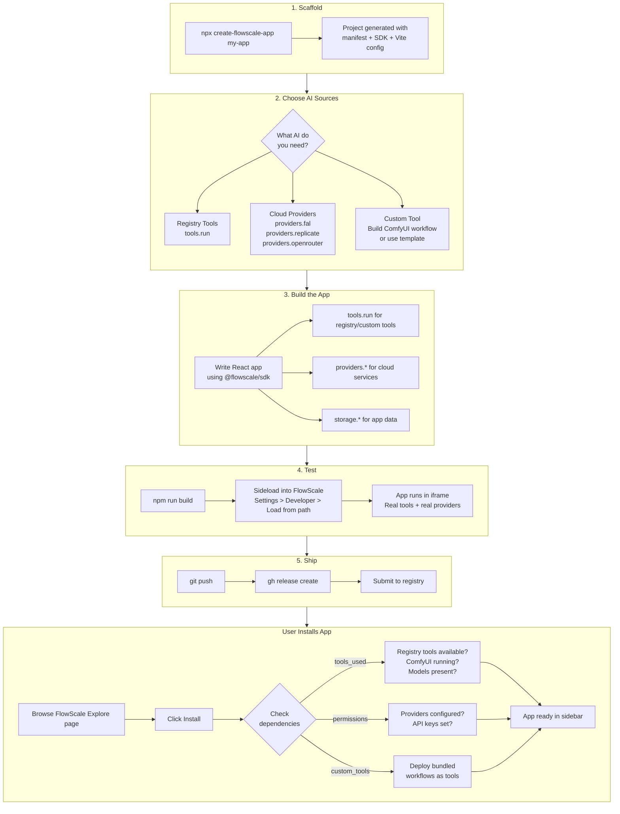
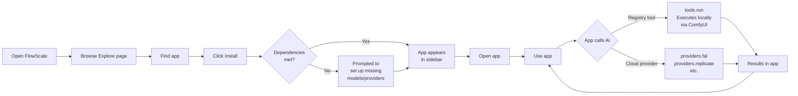

# FlowScale Developer Experience (MVP)

---

## Developer Journey Overview



## User Journey: Running an App



---

## Table of Contents

1. [Mental Model](#1-mental-model)
2. [Sources of AI Capabilities](#2-sources-of-ai-capabilities)
3. [Journey 1: Build an App with Registry Tools](#3-journey-1-build-an-app-with-registry-tools)
4. [Journey 2: Build an App with a Cloud Provider](#4-journey-2-build-an-app-with-a-cloud-provider)
5. [Journey 3: Add a Custom Tool via ComfyUI](#5-journey-3-add-a-custom-tool-via-comfyui)
6. [Journey 4: Add a Custom Model as a Tool](#6-journey-4-add-a-custom-model-as-a-tool)
7. [Journey 5: Build and Ship an App](#7-journey-5-build-and-ship-an-app)
8. [MVP SDK API](#8-mvp-sdk-api)
9. [MVP Registry Contents](#9-mvp-registry-contents)
10. [Edge Cases](#10-edge-cases)
11. [Example App](#11-example-app)

---

## 1. Mental Model

There is no single abstraction layer that unifies all AI providers. Each source of AI capability is its own thing, with its own parameters, its own response format, and its own strengths. The SDK gives developers clean, typed access to each one — but does not pretend they're interchangeable.

```
Sources of AI capabilities (from the developer's perspective):

  1. FlowScale Registry    -- Our curated tools. Our schema. Local inference.
  2. fal.ai                -- Their models, their API, their params.
  3. Replicate             -- Their models, their API, their params.
  4. OpenRouter             -- LLMs, their API format.
  5. HuggingFace Inference  -- Their models, their API.
  6. Custom Tools           -- Built by the user from ComfyUI workflows or custom models.
```

A developer explicitly chooses which source they're using. They don't call "text-to-image" and hope the platform figures it out. They call a specific tool on a specific provider.

```typescript
// Use a FlowScale registry tool (our schema)
const image = await tools.run('sdxl-txt2img', {
  prompt: 'a cat',
  width: 1024,
  height: 1024,
})

// Use fal.ai (fal's schema)
const image = await providers.fal('fal-ai/flux/dev', {
  prompt: 'a cat',
  image_size: 'landscape_16_9',
  num_inference_steps: 28,
})

// Use OpenRouter for text (OpenRouter's schema)
const text = await providers.openrouter('anthropic/claude-3.5-sonnet', {
  messages: [{ role: 'user', content: 'Write a scene description.' }],
  max_tokens: 500,
})

// Use a custom ComfyUI-based tool (its own auto-generated schema)
const result = await tools.run('my-custom-style-transfer', {
  content_image: sourceBlob,
  style_image: referenceBlob,
  strength: 0.7,
})
```

No magic. No hidden routing. The developer knows exactly what they're calling and what params it expects.

---

## 2. Sources of AI Capabilities

### FlowScale Registry

This is our curated catalog. Think of it as a local version of fal.ai that we maintain.

- We pick models that matter for creative production (SDXL, Flux, Depth Anything, RMBG, etc.)
- We pre-configure each as a tool with defined inputs, outputs, defaults, and validation
- Each tool runs locally through an inference engine (ComfyUI under the hood for MVP, but the developer doesn't need to know that)
- The developer calls `tools.run(toolId, inputs)` and gets structured outputs

The registry is a small, opinionated list. Not 800,000 HuggingFace models. Maybe 10-15 well-tested tools for MVP.

### Cloud Providers (fal.ai, Replicate, OpenRouter, HuggingFace)

These are separate services with their own APIs. The SDK gives pass-through access:

- Authentication is handled by the platform (API keys stored in FlowScale settings, not in app code)
- Routing is handled by the platform (goes through the host, no CORS issues)
- The developer uses the provider's native params — we don't translate or abstract them
- Each provider has its own SDK namespace: `providers.fal()`, `providers.replicate()`, etc.

Why no abstraction across providers? Because the inputs and outputs are genuinely different:

```typescript
// fal.ai Flux
await providers.fal('fal-ai/flux/dev', {
  prompt: 'a cat',
  image_size: 'landscape_16_9',    // fal-specific param
  num_inference_steps: 28,          // fal's name for this
  enable_safety_checker: false,     // fal-specific
})

// Replicate SDXL
await providers.replicate('stability-ai/sdxl', {
  prompt: 'a cat',
  width: 1024,                      // different param name
  height: 768,                      // different param name
  num_inference_steps: 25,          // same concept, different default
  guidance_scale: 7.5,              // Replicate calls it this
})
```

Same use case (text to image), completely different parameters. Abstracting these would mean inventing our own param format and maintaining translation layers for every provider — fragile, always out of date, hiding useful provider-specific features. Not worth it.

### Custom Tools (via ComfyUI)

Users who know ComfyUI can build workflows and deploy them as tools in FlowScale. These tools get their own ID and auto-generated schema (the Build Tool wizard already does this). Once deployed, they're called the same way as registry tools: `tools.run(toolId, inputs)`.

This is the advanced path. It's how FlowScale gets extended beyond what the registry offers. But it's not the default path for most developers.

### Custom Models (from HuggingFace, Civitai, etc.)

A developer finds a model they want to use. A model alone does nothing — it needs to be wrapped in a tool:
- Pair it with a workflow template (we provide basic ones)
- Or build a ComfyUI workflow around it
- Deploy via Build Tool wizard

There is no separate models registry. Models are simply files on disk that tools reference. When a tool needs a model, FlowScale checks if the file exists in ComfyUI's model directories. See Journey 4.

---

## 3. Journey 1: Build an App with Registry Tools

**Who:** A developer who wants to use AI capabilities we've already curated.
**Needs to know:** Tool IDs and their schemas. Nothing else.

### Steps

```
1. Browse the registry
   - In FlowScale UI: Tools > Registry
   - Or in code: const list = await tools.registry()
   - See: tool IDs, descriptions, input schemas, output schemas

2. Write app code
   import { tools } from '@flowscale/sdk'

   const result = await tools.run('sdxl-txt2img', {
     prompt: 'a mountain at sunset',
     width: 1024,
     height: 768,
   })

   const imageUrl = result.outputs.images[0].url

3. Declare in manifest
   {
     "tools_used": ["sdxl-txt2img"],
     "permissions": ["tools"]
   }

4. Test via sideloading
   npm run build
   FlowScale > Settings > Developer > Load from path

5. Ship
   git push && gh release create v1.0.0 ./dist/*
```

### What happens under the hood (developer doesn't see this)

When `tools.run('sdxl-txt2img', { ... })` is called:
1. Host looks up the tool definition in the registry
2. Tool definition includes a ComfyUI workflow and required model info
3. Host checks: is ComfyUI running? Is the model present?
4. If yes: executes the workflow, returns outputs in the defined schema
5. If no: returns error ("ComfyUI not running" or "Model not found")

The developer doesn't know or care that ComfyUI is the execution engine. They called a registry tool and got results.

### What happens when a user installs the app

```
FlowScale reads manifest: tools_used: ["sdxl-txt2img"]

Checks:
  - sdxl-txt2img requires: ComfyUI running + SDXL model file
  - ComfyUI running? Yes/No
  - SDXL model present? Yes/No

If something is missing:
  "This app uses 'SDXL Text to Image' which requires:
   - ComfyUI running (not detected)
   - SDXL Base 1.0 model (not found)
   [Set up now]  [Install anyway]"
```

---

## 4. Journey 2: Build an App with a Cloud Provider

**Who:** A developer who wants to use fal.ai, Replicate, OpenRouter, etc.
**Needs to know:** The provider's API docs. FlowScale handles auth and routing.

### Steps

```
1. Choose a provider and model
   Developer reads fal.ai docs, picks "fal-ai/flux/dev"

2. Write app code
   import { providers } from '@flowscale/sdk'

   const result = await providers.fal('fal-ai/flux/dev', {
     prompt: 'a mountain at sunset',
     image_size: 'landscape_16_9',
     num_inference_steps: 28,
   })

   const imageUrl = result.images[0].url

3. Declare in manifest
   {
     "permissions": ["providers:fal"]
   }

4. Test and ship (same as Journey 1)
```

### What the SDK provides

- **Auth injection** -- the user's fal.ai API key is stored in FlowScale settings. The SDK injects it into the request. The app never sees the key.
- **Routing** -- the request goes through the FlowScale host (not directly from the iframe). No CORS, no key exposure.
- **Error handling** -- provider errors are returned in a consistent wrapper:

```typescript
try {
  const result = await providers.fal('fal-ai/flux/dev', { prompt: '...' })
} catch (e) {
  if (e.code === 'PROVIDER_NOT_CONFIGURED') {
    // User hasn't set up fal.ai
    // Show: "This feature requires fal.ai. Set it up in FlowScale Settings > Providers."
  }
  if (e.code === 'PROVIDER_ERROR') {
    // fal.ai returned an error (rate limit, bad params, etc.)
    // e.providerError has the original error from fal
  }
}
```

### Can an app use both registry tools and cloud providers?

Yes. They're separate SDK namespaces. Mix freely:

```typescript
// Generate image locally via registry tool
const base = await tools.run('sdxl-txt2img', { prompt: '...' })

// Get creative writing from OpenRouter
const script = await providers.openrouter('anthropic/claude-3.5-sonnet', {
  messages: [{ role: 'user', content: `Write dialogue for: ${base.prompt}` }],
})

// Generate a variation on fal.ai
const variation = await providers.fal('fal-ai/flux/dev', {
  prompt: script.choices[0].message.content,
})
```

---

## 5. Journey 3: Add a Custom Tool via ComfyUI

**Who:** A developer or technical director who knows ComfyUI and wants to add a capability that's not in the registry.
**Result:** A new tool with its own ID and schema, callable via `tools.run()`.

### Steps

```
1. Build a workflow in ComfyUI
   - Wire up nodes: load model, sampler, postprocessing, save output
   - Test it works in ComfyUI directly

2. Open FlowScale > Build Tool (existing feature)
   - Upload the workflow JSON
   - FlowScale auto-analyzes: detects inputs (prompt, seed, dimensions) and outputs (images)
   - Developer names the tool, configures visible inputs, adds description
   - Test it runs correctly

3. Deploy
   - Tool gets an ID (e.g., "my-style-transfer")
   - Status flips to "production"

4. Use in app code
   const result = await tools.run('my-style-transfer', {
     content_image: sourceBlob,
     style_image: referenceBlob,
     strength: 0.7,
   })

5. Bundle with app (for distribution)
   Include the workflow JSON in the app repo:

   {
     "custom_tools": [
       {
         "id": "my-style-transfer",
         "workflow": "./workflows/my-style-transfer.json"
       }
     ]
   }

   When another user installs the app, FlowScale auto-deploys the tool.
```

### This is the advanced path

Most developers won't need this. It's for:
- Technical directors setting up studio pipelines
- Developers who need something specific not in the registry
- Power users who want full control over the AI pipeline

---

## 6. Journey 4: Add a Custom Model as a Tool

**Who:** A developer who found a model on HuggingFace or Civitai and wants to use it.
**Key fact:** A model alone does nothing. It needs to be wrapped in a tool.

### Steps

```
1. Get the model file
   - Download from HuggingFace, Civitai, etc.
   - Place in ComfyUI's models directory

2. Create a tool around the model
   Option A: Use a workflow template
     - FlowScale > Build Tool > Start from Template
     - Pick template: "Text to Image" (for checkpoints)
     - Select model from dropdown (shows files in ComfyUI model dirs)
     - FlowScale generates a ComfyUI workflow using that model
     - Configure inputs/outputs, test, deploy

   Option B: Build a ComfyUI workflow manually
     - Same as Journey 3

3. Use in app
   await tools.run('my-custom-model-tool', { prompt: '...' })
```

### Workflow templates

Templates bridge the gap between "I have a model file" and "I have a working tool." They are pre-made ComfyUI workflow skeletons for common model types:

| Template | For model type | Pre-wired inputs |
|----------|---------------|------------------|
| Text to Image | Checkpoint (SD, SDXL, Flux) | prompt, neg_prompt, width, height, seed, steps, cfg |
| Image to Image | Checkpoint | image, prompt, strength, seed |
| Upscale | Upscaler | image, scale_factor |
| Depth Estimation | Depth model | image |
| Remove Background | Segmentation model | image |

A template is a `.json` ComfyUI workflow with a placeholder for the model path. Developer picks a template, picks a model, FlowScale wires them together, developer tests and deploys. No ComfyUI node graph knowledge needed.

---

## 7. Journey 5: Build and Ship an App

The complete flow from idea to published app.

```
1. SCAFFOLD
   npx create-flowscale-app my-app
   cd my-app && npm install

2. CHOOSE YOUR AI SOURCES
   - Browse FlowScale registry for available tools
   - Decide if you need any cloud providers
   - Decide if you need custom tools

3. WRITE THE APP
   - React app using @flowscale/sdk
   - tools.run() for registry/custom tools
   - providers.fal/replicate/openrouter() for cloud
   - storage.get/set() for app data
   - storage.files.write/read() for file output

4. WRITE THE MANIFEST
   {
     "name": "my-app",
     "displayName": "My App",
     "version": "1.0.0",
     "sdk": "^1.0.0",
     "entry": "./dist/index.js",
     "tools_used": ["sdxl-txt2img", "remove-background"],
     "permissions": ["tools", "providers:fal", "storage:readwrite", "storage:files"],
     "custom_tools": [],
     "capabilities": { "slots": ["main-app"] }
   }

5. TEST
   npm run build
   FlowScale > Settings > Developer > Load from path

6. SHIP
   git push
   gh release create v1.0.0 ./dist/*
   (submit to registry when it exists)
```

---

## 8. MVP SDK API

### `tools` — FlowScale registry tools and custom tools

```typescript
// List all available tools (registry + custom deployed)
tools.list(): Promise<Tool[]>

// List only registry tools
tools.registry(): Promise<Tool[]>

// Get a tool's schema
tools.get(toolId: string): Promise<Tool>

// Run a tool
tools.run(toolId: string, inputs: Record<string, any>): Promise<ToolResult>

// Run with streaming progress
tools.stream(toolId: string, inputs: Record<string, any>): AsyncIterable<ProgressEvent>
```

### `providers` — Cloud AI services (pass-through)

```typescript
// Each provider is its own function. Native params, native response.
providers.fal(endpoint: string, params: Record<string, any>): Promise<any>
providers.replicate(model: string, params: Record<string, any>): Promise<any>
providers.openrouter(model: string, params: Record<string, any>): Promise<any>
providers.huggingface(model: string, params: Record<string, any>): Promise<any>

// Check which providers are configured
providers.list(): Promise<{ name: string, configured: boolean }[]>
```

### `storage` — App-scoped persistence

```typescript
// Key-value
storage.get<T>(key: string): Promise<T | null>
storage.set<T>(key: string, value: T): Promise<void>
storage.delete(key: string): Promise<void>
storage.list(prefix?: string): Promise<string[]>

// Files
storage.files.write(path: string, data: Blob | ArrayBuffer): Promise<string>
storage.files.read(path: string): Promise<Blob>
storage.files.delete(path: string): Promise<void>
storage.files.list(dir?: string): Promise<FileInfo[]>
```

### `ui` — Host integration

```typescript
ui.showNotification(opts: { type: 'success' | 'error' | 'info', message: string }): void
ui.confirm(opts: { title: string, message: string }): Promise<boolean>
ui.theme.get(): Promise<ThemeTokens>
```

### `app` — Lifecycle

```typescript
app.on('activate', callback: () => void): void
app.on('deactivate', callback: () => void): void
app.getContext(): Promise<AppContext>
```

### Types

```typescript
interface Tool {
  id: string
  name: string
  description: string
  source: 'registry' | 'custom'       // registry = ours, custom = user-deployed
  inputs: Record<string, ParamDef>
  outputs: Record<string, ParamDef>
}

interface ParamDef {
  type: 'string' | 'number' | 'boolean' | 'image' | 'select'
  required?: boolean
  default?: any
  description?: string
  options?: (string | number)[]
  min?: number
  max?: number
}

interface ToolResult {
  id: string
  toolId: string
  status: 'completed' | 'error'
  outputs: Record<string, any>
  duration: number
  error?: string
}

interface ProgressEvent {
  progress: number
  status: string
  preview?: string
  result?: ToolResult
}
```

---

## 9. MVP Registry Contents

The tools we pre-configure, test, and ship:

| Tool ID | Name | Category | Requires |
|---------|------|----------|----------|
| `sdxl-txt2img` | SDXL Text to Image | Image Generation | SDXL checkpoint |
| `sdxl-img2img` | SDXL Image to Image | Image Transform | SDXL checkpoint |
| `flux-dev-txt2img` | Flux Dev Text to Image | Image Generation | Flux Dev checkpoint |
| `flux-schnell-txt2img` | Flux Schnell Text to Image | Image Generation | Flux Schnell checkpoint |
| `remove-background` | Remove Background | Image Processing | RMBG model |
| `real-esrgan-upscale` | Upscale 4x | Image Processing | RealESRGAN model |
| `depth-anything-v2` | Depth Estimation | Image Analysis | Depth Anything V2 model |
| `dwpose-estimation` | Pose Estimation | Image Analysis | DWPose model |
| `sdxl-inpaint` | SDXL Inpainting | Image Editing | SDXL Inpaint checkpoint |

Each tool is a JSON definition stored in the FlowScale codebase with:
- Input/output schema
- A tested ComfyUI workflow
- Required model files list
- Required custom nodes list (if any)

The registry grows over time. Community contributions welcome.

---

## 10. Edge Cases

### Registry tool fails because ComfyUI is down

```typescript
const result = await tools.run('sdxl-txt2img', { prompt: '...' })
// Throws: { code: 'EXECUTION_ENGINE_UNAVAILABLE',
//           message: 'ComfyUI is not running. Start it to use local tools.' }
```

### Registry tool fails because model is missing

```typescript
const result = await tools.run('flux-dev-txt2img', { prompt: '...' })
// Throws: { code: 'MODEL_NOT_FOUND',
//           model: 'flux-dev',
//           message: 'Flux Dev model not found. Download it or add it in Models.' }
```

### Cloud provider not configured

```typescript
const result = await providers.fal('fal-ai/flux/dev', { prompt: '...' })
// Throws: { code: 'PROVIDER_NOT_CONFIGURED',
//           provider: 'fal',
//           message: 'fal.ai not configured. Add your API key in Settings > Providers.' }
```

### Custom tool doesn't exist on user's machine

App bundles the workflow in `custom_tools` in the manifest. On install, FlowScale auto-deploys it. If the app doesn't bundle it, `tools.run()` throws `TOOL_NOT_FOUND`.

### Custom tool needs custom ComfyUI nodes the user doesn't have

On install, FlowScale analyzes the workflow and lists required custom nodes. User is prompted to install them via ComfyUI Manager.

---

## 11. Example App

### "Concept Explorer" — compare outputs across sources

```typescript
// src/App.tsx
import { useState } from 'react'
import { tools, providers, storage, ui } from '@flowscale/sdk'

interface Result {
  source: string
  url: string
}

export function App() {
  const [prompt, setPrompt] = useState('')
  const [results, setResults] = useState<Result[]>([])
  const [loading, setLoading] = useState(false)

  async function generate() {
    setLoading(true)
    setResults([])

    // Generate with FlowScale registry tool (local SDXL)
    try {
      const local = await tools.run('sdxl-txt2img', {
        prompt,
        width: 1024,
        height: 1024,
      })
      setResults(prev => [...prev, {
        source: 'SDXL (local)',
        url: local.outputs.images[0].url,
      }])
    } catch (e) {
      // Local not available — that's fine, continue
    }

    // Generate with fal.ai (cloud Flux)
    try {
      const cloud = await providers.fal('fal-ai/flux/dev', {
        prompt,
        image_size: { width: 1024, height: 1024 },
        num_inference_steps: 28,
      })
      setResults(prev => [...prev, {
        source: 'Flux Dev (fal.ai)',
        url: cloud.images[0].url,
      }])
    } catch (e) {
      // fal.ai not configured — that's fine, continue
    }

    setLoading(false)
  }

  async function save(result: Result) {
    const blob = await fetch(result.url).then(r => r.blob())
    await storage.files.write(`favorites/${Date.now()}.png`, blob)
    ui.showNotification({ type: 'success', message: 'Saved!' })
  }

  return (
    <div style={{ padding: 24 }}>
      <h1>Concept Explorer</h1>
      <input
        value={prompt}
        onChange={e => setPrompt(e.target.value)}
        placeholder="Describe your concept..."
      />
      <button onClick={generate} disabled={loading || !prompt}>
        {loading ? 'Generating...' : 'Generate'}
      </button>

      <div style={{ display: 'grid', gridTemplateColumns: 'repeat(2, 1fr)', gap: 16 }}>
        {results.map((r, i) => (
          <div key={i}>
            
            <p>{r.source}</p>
            <button onClick={() => save(r)}>Save</button>
          </div>
        ))}
      </div>
    </div>
  )
}
```

### Manifest

```json
{
  "name": "concept-explorer",
  "displayName": "Concept Explorer",
  "version": "1.0.0",
  "sdk": "^1.0.0",
  "entry": "./dist/index.js",
  "tools_used": ["sdxl-txt2img"],
  "permissions": ["tools", "providers:fal", "storage:readwrite", "storage:files"],
  "capabilities": { "slots": ["main-app"] }
}
```

Notice: the app uses BOTH a registry tool (SDXL local) and a cloud provider (fal.ai Flux). They're separate calls with separate params. The developer explicitly chose each. If one fails (not available), the other still works.

---

## Summary

Three ways to use AI in a FlowScale app:

1. **`tools.run()`** — FlowScale registry tools or custom tools. Our schema. Runs locally.
2. **`providers.fal/replicate/openrouter()`** — Cloud services. Their schema. Runs in their cloud.
3. **Custom tools** — User builds a ComfyUI workflow or uses a template. Deployed locally. Called via `tools.run()`.

No cross-provider abstraction. No magic routing. The developer explicitly picks their source and writes to its interface.
