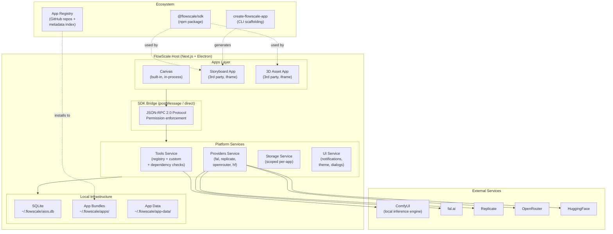
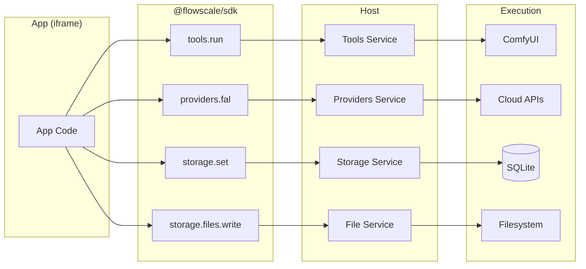

# FlowScale Ecosystem Architecture (MVP)

> AI will not replace creative teams -- it will become infrastructure embedded inside their pipelines. FlowScale is that infrastructure.

---

## Architecture Overview



## Data Flow



---

## Table of Contents

1. [What We Are Building](#1-what-we-are-building)
2. [System Overview](#2-system-overview)
3. [Sources of AI Capabilities](#3-sources-of-ai-capabilities)
4. [The SDK](#4-the-sdk)
5. [App Manifest](#5-app-manifest)
6. [App Runtime & Isolation](#6-app-runtime--isolation)
7. [SDK Bridge Protocol](#7-sdk-bridge-protocol)
8. [MVP SDK API](#8-mvp-sdk-api)
9. [Tool Registry](#9-tool-registry)
10. [App Registry & Installation](#10-app-registry--installation)
11. [Database Schema Additions](#11-database-schema-additions)
12. [Data Flow & Filesystem Layout](#12-data-flow--filesystem-layout)
13. [Developer Experience](#13-developer-experience)
14. [Implementation Plan (MVP)](#14-implementation-plan-mvp)
15. [Key Design Decisions](#15-key-design-decisions)

---

## 1. What We Are Building

FlowScale is a local-first platform that lets creative teams run AI inside their production pipelines. On top of this core, we are building an **app ecosystem** where:

- **Developers** build creative AI apps as separate GitHub repos using our SDK.
- **Users** install those apps from a registry and run them inside FlowScale on their own machines.
- **Apps** access AI through two paths: our curated tool registry (local inference) and cloud providers (fal.ai, Replicate, OpenRouter, etc.) — each with their own interface.

The Canvas app that already exists in FlowScale is the first example of what an ecosystem app looks like.

### Competitive position

Nothing does this exact combination:

- **ComfyUI** -- workflow engine (we build on it), but a tool, not a platform.
- **Jan.ai** -- local-first with extensions, but LLM-only.
- **Ollama** -- local model runtime, no UI or creative tooling.
- **Runway / Adobe** -- AI for creatives, but cloud-locked and closed.
- **fal.ai / Replicate** -- cloud inference APIs, no local story or app ecosystem.

FlowScale's position: **local-first AI infrastructure + app ecosystem + SDK + tool registry, for creative production teams.**

---

## 2. System Overview

```
+------------------------------------------------------------------+
|  FlowScale Host (Next.js + Electron)                             |
|                                                                  |
|  +-----------+  +-------------+  +-------------+                 |
|  |  Canvas   |  | Storyboard  |  | 3D Asset    |                 |
|  |  (built-  |  | (3rd party  |  | (3rd party  |                 |
|  |   in)     |  |  iframe)    |  |  iframe)    |                 |
|  +-----+-----+  +------+------+  +------+------+                 |
|        |               |               |                         |
|  +-----+---------------+---------------+-----+                   |
|  |            SDK Bridge (postMessage)        |                   |
|  +-----+----------+----------+----------+----+                   |
|        |          |          |          |                         |
|  +-----+--+  +---+----+  +--+------+  +--+------+               |
|  | Tools   |  |Providers|  | Storage |  | Models |               |
|  |(registry |  |(fal,    |  |(scoped  |  |(local  |               |
|  | +custom) |  |replicate|  | per-app)|  | index) |               |
|  +----+-----+  |openrtr) |  +---+----+  +---+----+               |
|       |        +----+-----+     |            |                   |
|       |             |           |            |                   |
|  +----+-------------+-----------+------------+-----------+       |
|  |                Local Infrastructure                   |       |
|  |  SQLite (~/.flowscale/aios.db)                        |       |
|  |  Model files (~/.flowscale/models/ + ComfyUI dirs)    |       |
|  |  App bundles (~/.flowscale/apps/{id}/)                |       |
|  |  App data (~/.flowscale/app-data/{id}/)               |       |
|  +--+----------------------------------------------------+       |
|     |                                                            |
|  +--+---------------------+  +-----------------------------+    |
|  | ComfyUI (local)        |  | Cloud Providers             |    |
|  | Executes registry      |  | fal.ai, Replicate,          |    |
|  | tools + custom tools   |  | OpenRouter, HuggingFace     |    |
|  +------------------------+  +-----------------------------+    |
+------------------------------------------------------------------+
```

Key distinction in the diagram:

- **Tools** (left) = our registry + user-deployed custom tools. Run locally via ComfyUI. Have our defined schemas.
- **Providers** (right) = cloud services. Separate APIs, separate params. Pass-through from the SDK.

These are not interchangeable backends for the same thing. They are separate sources of AI capability with separate interfaces.

---

## 3. Sources of AI Capabilities

### FlowScale Tool Registry

Our curated catalog of tools. Think of it as a local version of fal.ai that we maintain.

- Each tool has a stable ID, pre-configured input/output schema, required models list
- Each tool is backed by a tested ComfyUI workflow (the developer doesn't need to know this)
- Runs on the user's local machine via ComfyUI
- Called via `tools.run(toolId, inputs)`
- MVP ships ~10 tools (see Section 9)

### Cloud Providers

fal.ai, Replicate, OpenRouter, HuggingFace Inference — each is a separate service with its own API.

- The SDK provides pass-through access: `providers.fal(endpoint, params)`
- Authentication handled by FlowScale (API keys in settings, injected by host)
- Routing handled by FlowScale (goes through host, no CORS)
- Developer uses the provider's native parameter format — no translation
- Each provider has genuinely different params/responses even for similar models

### Custom Tools

Users build ComfyUI workflows and deploy them as tools via the Build Tool wizard (existing feature). These get their own ID and auto-generated schema, callable via `tools.run()`.

### Custom Models

Users can bring models from HuggingFace, Civitai, etc. These models need to be wrapped in a tool (via workflow template or manual ComfyUI workflow) before they can be used in apps. There is no separate models registry — models are dependencies of tools, checked via file existence in ComfyUI's model directories at install time and runtime.

---

## 4. The SDK

Two packages:

```
@flowscale/sdk          -- Runtime API (tools, providers, storage, UI, lifecycle)
create-flowscale-app    -- CLI for scaffolding and dev server
```

No component library. Instead: design tokens via `ui.theme.get()` and domain-specific host integrations (`ui.showNotification()`, `ui.confirm()`).

### What the SDK abstracts

- ComfyUI WebSocket connections and prompt queuing (for registry/custom tools)
- Cloud provider authentication and routing
- SQLite queries (for storage)
- File system paths (for file storage)
- Model dependency checks (for tool requirements)
- Host app internals

### Two runtime modes

1. **In-host mode** -- SDK calls go through postMessage bridge (iframe apps) or direct calls (built-in apps). Host validates permissions and executes.
2. **Standalone dev mode** -- `create-flowscale-app dev` runs a local Vite dev server. For MVP, developer tests against real FlowScale via sideloading.

---

## 5. App Manifest

Every app has `flowscale.app.json` at root:

```json
{
  "name": "concept-explorer",
  "displayName": "Concept Explorer",
  "description": "Generate and compare concept art across AI models.",
  "version": "1.0.0",
  "sdk": "^1.0.0",
  "entry": "./dist/index.js",
  "icon": "./assets/icon.png",
  "tools_used": ["sdxl-txt2img", "remove-background"],
  "permissions": [
    "tools",
    "providers:fal",
    "storage:readwrite",
    "storage:files"
  ],
  "custom_tools": [
    {
      "id": "my-style-transfer",
      "workflow": "./workflows/my-style-transfer.json"
    }
  ],
  "capabilities": {
    "slots": ["main-app"]
  },
  "author": {
    "name": "Studio X",
    "url": "https://github.com/studio-x"
  },
  "repository": "https://github.com/studio-x/concept-explorer"
}
```

### Key fields

| Field | Purpose |
|-------|---------|
| `tools_used` | Registry tools the app needs. On install, FlowScale checks if the execution engine (ComfyUI) and required models are available. |
| `permissions` | What the app can access. `tools` = run local tools. `providers:fal` = call fal.ai. `storage:readwrite` = key-value storage. `storage:files` = file read/write. |
| `custom_tools` | Workflow JSONs bundled with the app. Auto-deployed on install so tool IDs are guaranteed to exist on any machine. |
| `capabilities.slots` | Where the app renders: `main-app` (full page in sidebar), `canvas-plugin` (panel in Canvas), `tool-panel` (tools extension). |

### Permission types

```
tools                    -- Run registry and custom tools
providers:fal            -- Call fal.ai
providers:replicate      -- Call Replicate
providers:openrouter     -- Call OpenRouter
providers:huggingface    -- Call HuggingFace Inference
storage:readwrite        -- Key-value storage (scoped per app)
storage:files            -- File read/write (scoped per app)
ui:notifications         -- Show host notifications
ui:modal                 -- Open host dialogs
```

---

## 6. App Runtime & Isolation

### Third-party apps: iframe sandbox

Community and third-party apps run in iframes:

- **Security isolation** -- cannot access host DOM, cookies, localStorage, or other apps' data.
- **Crash isolation** -- broken app doesn't crash host.
- **Permission enforcement** -- bridge only forwards SDK calls matching declared permissions.

```
Host creates:
  <iframe src="flowscale://app/{app-id}/index.html" sandbox="allow-scripts" />

SDK auto-connects:
  import { tools } from '@flowscale/sdk'  // detects iframe, sets up bridge
```

### First-party apps: in-process

Built-in apps (Canvas) run directly in Next.js for performance. Same SDK interface, direct function calls instead of postMessage.

Critical constraint: **first-party apps use the same SDK as third-party.** If Canvas needs a capability, it gets added to the SDK.

---

## 7. SDK Bridge Protocol

JSON-RPC 2.0 over postMessage:

```typescript
// App side (SDK internals)
window.parent.postMessage({
  jsonrpc: '2.0',
  method: 'tools.run',
  params: { toolId: 'sdxl-txt2img', inputs: { prompt: 'a cat' } },
  id: 1
}, '*')

// Host side
window.addEventListener('message', async (event) => {
  // 1. Validate origin
  // 2. Check permissions
  // 3. Execute
  // 4. Respond
  event.source.postMessage({
    jsonrpc: '2.0',
    result: { outputs: { images: [...] } },
    id: 1
  }, event.origin)
})
```

### Streaming

For long-running tool executions, host pushes progress:

```typescript
// Host sends progress to app
iframe.contentWindow.postMessage({
  jsonrpc: '2.0',
  method: 'tools.progress',
  params: { requestId: 1, progress: 0.45, preview: '...' }
}, '*')
```

SDK exposes as async iterable:

```typescript
for await (const event of tools.stream('sdxl-txt2img', inputs)) {
  console.log(event.progress)  // 0.0 ... 1.0
}
```

---

## 8. MVP SDK API

### `tools` — Registry tools and custom tools

```typescript
tools.list(): Promise<Tool[]>          // all available tools
tools.registry(): Promise<Tool[]>     // only registry tools
tools.get(toolId: string): Promise<Tool>
tools.run(toolId: string, inputs: Record<string, any>): Promise<ToolResult>
tools.stream(toolId: string, inputs: Record<string, any>): AsyncIterable<ProgressEvent>
```

### `providers` — Cloud services (pass-through, native params)

```typescript
providers.fal(endpoint: string, params: Record<string, any>): Promise<any>
providers.replicate(model: string, params: Record<string, any>): Promise<any>
providers.openrouter(model: string, params: Record<string, any>): Promise<any>
providers.huggingface(model: string, params: Record<string, any>): Promise<any>
providers.list(): Promise<{ name: string, configured: boolean }[]>
```

### `storage` — App-scoped persistence

```typescript
storage.get<T>(key: string): Promise<T | null>
storage.set<T>(key: string, value: T): Promise<void>
storage.delete(key: string): Promise<void>
storage.list(prefix?: string): Promise<string[]>

storage.files.write(path: string, data: Blob | ArrayBuffer): Promise<string>
storage.files.read(path: string): Promise<Blob>
storage.files.delete(path: string): Promise<void>
storage.files.list(dir?: string): Promise<FileInfo[]>
```

### `ui` — Host integration

```typescript
ui.showNotification(opts: { type: 'success' | 'error' | 'info', message: string }): void
ui.confirm(opts: { title: string, message: string }): Promise<boolean>
ui.theme.get(): Promise<ThemeTokens>
```

### `app` — Lifecycle

```typescript
app.on('activate', callback: () => void): void
app.on('deactivate', callback: () => void): void
app.getContext(): Promise<{ appId: string, userId: string | null, permissions: string[] }>
```

---

## 9. Tool Registry

The tool registry is a curated catalog of AI capabilities maintained by FlowScale. Each tool is a JSON definition shipped with the app.

### What a registry entry contains

```json
{
  "id": "sdxl-txt2img",
  "name": "SDXL Text to Image",
  "description": "Generate images from text prompts using Stable Diffusion XL.",
  "category": "image-generation",
  "version": "1.0.0",
  "schema": {
    "inputs": {
      "prompt": { "type": "string", "required": true },
      "negative_prompt": { "type": "string", "default": "" },
      "width": { "type": "number", "default": 1024 },
      "height": { "type": "number", "default": 1024 },
      "seed": { "type": "number", "default": -1 },
      "steps": { "type": "number", "default": 20, "min": 1, "max": 50 },
      "cfg_scale": { "type": "number", "default": 7, "min": 1, "max": 20 }
    },
    "outputs": {
      "images": { "type": "image[]" },
      "seed": { "type": "number" }
    }
  },
  "execution": {
    "workflow": "workflows/sdxl-txt2img.json",
    "models_required": ["sd_xl_base_1.0.safetensors"],
    "custom_nodes_required": []
  }
}
```

The `execution` block is internal — it tells FlowScale how to run this tool (which ComfyUI workflow, which models). The developer only sees the `schema`.

### MVP registry contents

| Tool ID | Name | Category |
|---------|------|----------|
| `sdxl-txt2img` | SDXL Text to Image | Image Generation |
| `sdxl-img2img` | SDXL Image to Image | Image Transform |
| `flux-dev-txt2img` | Flux Dev Text to Image | Image Generation |
| `flux-schnell-txt2img` | Flux Schnell Text to Image | Image Generation |
| `remove-background` | Remove Background | Image Processing |
| `real-esrgan-upscale` | Upscale 4x | Image Processing |
| `depth-anything-v2` | Depth Estimation | Image Analysis |
| `dwpose-estimation` | Pose Estimation | Image Analysis |
| `sdxl-inpaint` | SDXL Inpainting | Image Editing |

### Where the registry lives

MVP: JSON files in the FlowScale codebase:

```
apps/web/src/registry/
  tools/
    sdxl-txt2img.json
    flux-dev-txt2img.json
    remove-background.json
    ...
  workflows/
    sdxl-txt2img.json      (ComfyUI workflow)
    flux-dev-txt2img.json
    ...
```

Post-MVP: hosted registry service, updateable independently.

---

## 10. App Registry & Installation

### How apps are distributed

Apps live on GitHub. The app registry is a lightweight metadata index.

```
Developer:
  1. Builds app with @flowscale/sdk
  2. Pushes to GitHub
  3. Submits repo URL to registry

Registry:
  1. Reads flowscale.app.json
  2. Validates manifest
  3. Indexes metadata

User:
  1. Browses registry in FlowScale Explore page
  2. Clicks Install
  3. FlowScale downloads bundle, validates, registers locally
  4. App appears in sidebar
```

### Installation checks

```
Reading manifest...
  tools_used: ["sdxl-txt2img", "remove-background"]
  permissions: ["tools", "providers:fal"]
  custom_tools: [{ id: "my-tool", workflow: "./workflows/my-tool.json" }]

Checking tools:
  sdxl-txt2img:
    ComfyUI: running? YES
    Model sd_xl_base_1.0: present? YES
    --> OK

  remove-background:
    ComfyUI: running? YES
    Model rmbg: present? NO
    --> "Download RMBG model or locate on disk"

Deploying custom tools:
  my-tool: deploying workflow... OK

Checking providers:
  fal: configured? YES
  --> OK

Installing app...
  Bundle saved to ~/.flowscale/apps/concept-explorer/
  Registered in database
  App appears in sidebar
```

### Sideloading (for development)

Settings > Developer > Load from path. App loads in iframe from local `dist/` directory.

---

## 11. Database Schema Additions

### `installed_apps`

```sql
CREATE TABLE installed_apps (
  id           TEXT PRIMARY KEY,
  display_name TEXT NOT NULL,
  version      TEXT NOT NULL,
  sdk_version  TEXT NOT NULL,
  manifest     TEXT NOT NULL,
  bundle_path  TEXT NOT NULL,
  repo_url     TEXT,
  permissions  TEXT NOT NULL,
  enabled      INTEGER NOT NULL DEFAULT 1,
  installed_at TEXT NOT NULL,
  updated_at   TEXT NOT NULL
);
```

### `app_storage`

```sql
CREATE TABLE app_storage (
  app_id       TEXT NOT NULL,
  key          TEXT NOT NULL,
  value        TEXT NOT NULL,
  updated_at   TEXT NOT NULL,
  PRIMARY KEY (app_id, key)
);
```

---

## 12. Data Flow & Filesystem Layout

### Where everything lives

```
~/.flowscale/
  +-- aios.db                       <-- Main database
  +-- models/                       <-- Downloaded model files
  +-- apps/                         <-- Installed app bundles (code)
  |   +-- concept-explorer/
  |       +-- dist/
  +-- app-data/                     <-- Per-app file storage (isolated)
      +-- concept-explorer/
          +-- favorites/
          +-- exports/
```

### What happens when an app does things

**Registry tool call:**
```
tools.run('sdxl-txt2img', { prompt: '...' })
  --> SDK sends over bridge to host
  --> Host looks up tool in registry, gets ComfyUI workflow
  --> Host queues workflow on ComfyUI, monitors via WebSocket
  --> Returns outputs in the tool's defined schema
```

**Cloud provider call:**
```
providers.fal('fal-ai/flux/dev', { prompt: '...' })
  --> SDK sends over bridge to host
  --> Host injects API key, sends HTTP request to fal.ai
  --> Returns fal.ai's native response to the app
```

**Storage:**
```
storage.set('project:123', { ... })
  --> Host writes to app_storage table, scoped to this app
  --> Only this app can read it back

storage.files.write('output.png', blob)
  --> Host saves to ~/.flowscale/app-data/{app-id}/output.png
  --> Only this app can access its directory
```

---

## 13. Developer Experience

### Scaffolding

```bash
npx create-flowscale-app my-app
cd my-app && npm install
```

### Generated structure

```
my-app/
  flowscale.app.json
  package.json
  tsconfig.json
  vite.config.ts
  src/
    index.tsx
    App.tsx
  assets/
    icon.png
```

### Development workflow

```bash
# Build
npm run build

# Sideload into FlowScale for testing
# FlowScale > Settings > Developer > Load from path > ~/my-app/dist/

# Ship
git push
gh release create v1.0.0 ./dist/*
```

### Design tokens (not a component library)

No React component library. Apps run in iframes — visual consistency inside an app is the developer's choice.

What we provide:

- `ui.theme.get()` returns color palette, fonts, spacing, border radii — developers can match the host look if they want
- `ui.showNotification()` and `ui.confirm()` — host-level UI that always matches
- Domain-specific SDK features (streaming progress, dependency checks) that save real work

---

## 14. Implementation Plan (MVP)

### Phase 1: SDK + Tool Registry

- Define `@flowscale/sdk` TypeScript types and interfaces
- Build the tool registry: JSON definitions for ~10 tools with tested ComfyUI workflows
- Build the `tools.run()` pipeline: registry lookup → ComfyUI execution → structured output
- Build the `providers.*` pipeline: auth injection → HTTP proxy → pass-through response
- Build model dependency checking: file existence checks against ComfyUI model directories
- Validate: Canvas uses the SDK internally (proves the API)

### Phase 2: App Runtime

- Build the iframe host and postMessage bridge
- Build the app loader (read manifest, create iframe, establish channel)
- Implement permission enforcement in the bridge
- Build sideloading (Settings > Developer > Load from path)
- Build `app_storage` and scoped file storage
- Ship `create-flowscale-app` scaffolding CLI
- Build one example third-party app to validate end-to-end

### Phase 3: App Registry

- Build the app registry service (metadata index, validation)
- Build the Explore page (browse, install, update)
- Build installation flow (download, validate, deploy custom tools, check model dependencies)
- Seed with 3-5 example apps

---

## 15. Key Design Decisions

| Decision | Rationale |
|----------|-----------|
| **Registry as a local fal.ai** | Our tool registry is a curated catalog with pre-configured schemas. Not a backend router. Not an abstraction layer. A source of tools, like fal.ai is a source of models. |
| **No cross-provider abstraction** | SDXL on fal.ai has different params than SDXL on our registry. They're different tools from different sources. Abstracting them would be fragile and would hide provider-specific features. |
| **ComfyUI as infrastructure, not product** | ComfyUI is how registry tools and custom tools execute locally. Developers don't need to know it exists. |
| **Cloud providers as pass-through** | SDK handles auth and routing. Developer uses native provider params. No translation layer to maintain. |
| **No separate models registry** | Models are dependencies of tools, not first-class entities in MVP. Tool definitions declare required model files. FlowScale checks file existence in ComfyUI directories at install/run time. A full model manager is a post-MVP feature. |
| **iframe isolation** | Security and crash isolation for third-party apps. Battle-tested browser technology. |
| **Scoped storage** | Apps can't read each other's data. Clean uninstall. Simple backup. |
| **Bundled custom tools** | Apps include workflow JSONs in their repo. On install, FlowScale deploys them. Tool IDs are guaranteed to exist on any machine. |
| **No component library** | Design tokens + host UI hooks. Apps own their UI. Avoids massive maintenance burden. |
| **Same SDK for built-in and third-party** | Canvas uses the same SDK. Keeps it honest and complete. |
