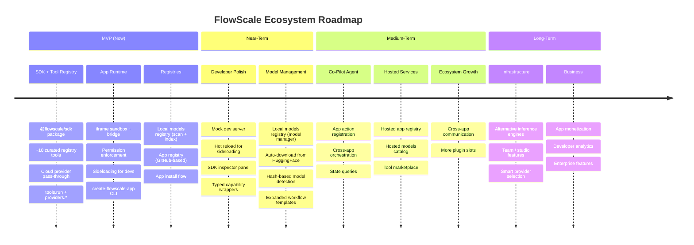
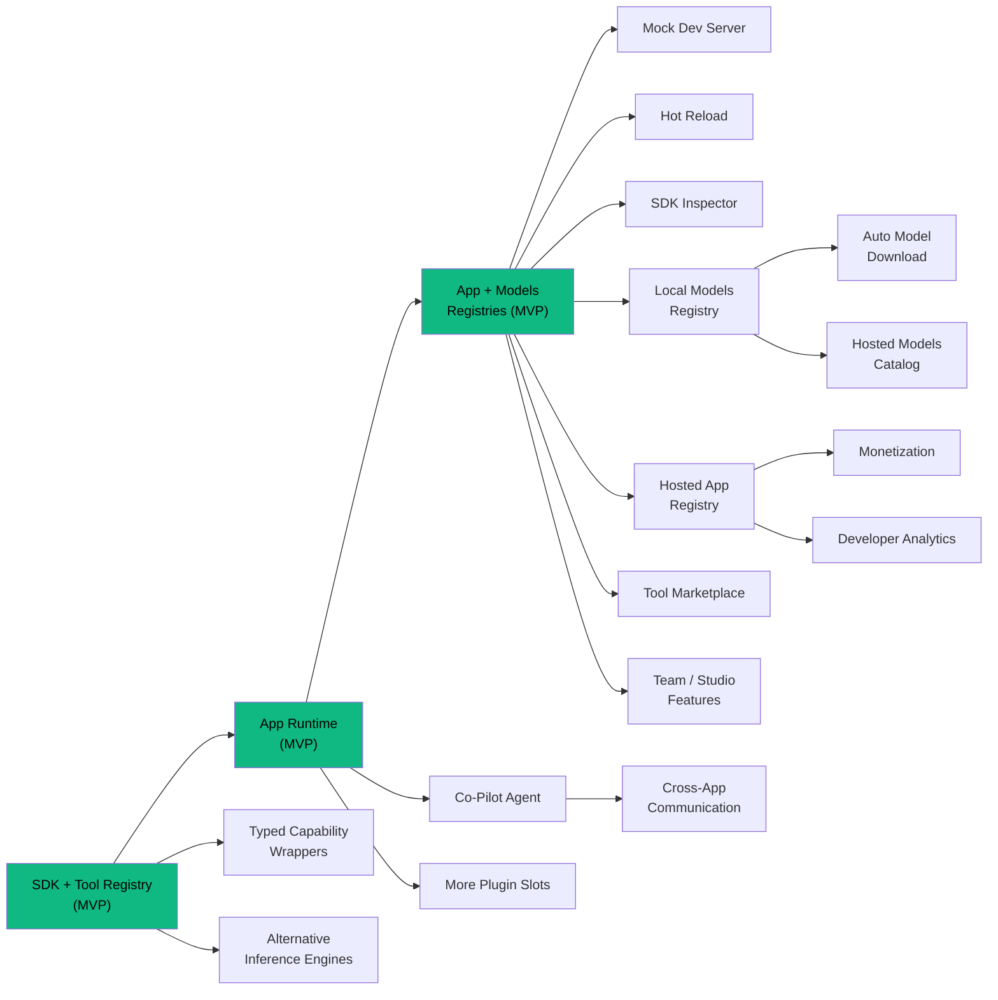

# FlowScale Future Roadmap

> Everything here is post-MVP. The MVP is defined in ECOSYSTEM_ARCHITECTURE.md and DEV_UX.md.

---

## Roadmap Overview



## Feature Dependency Map



---

## Near-Term (After MVP Stabilizes)

### Typed Capability Functions

Convenience layer on top of `tools.run()`:

```typescript
// Instead of:
await tools.run('sdxl-txt2img', { prompt: '...', width: 1024 })

// Developer could also use:
await inference.textToImage({ prompt: '...', width: 1024 })
```

These are thin wrappers that map to registry tools internally. They add autocomplete and type safety for common use cases without replacing the `tools.run()` primitive.

### Mock Dev Server

A standalone dev server that simulates the FlowScale host:
- `tools.run()` returns placeholder images after a fake delay
- `providers.*` returns mock responses
- `storage.*` uses localStorage
- No FlowScale instance needed for UI development

### Hot Reload for Sideloaded Apps

File watcher that auto-reloads the iframe when the developer rebuilds. Eliminates the manual re-sideload step during development.

### SDK Inspector

A floating dev panel inside the dev server or sideloaded apps:
- Shows every SDK call with request/response payloads
- Like browser DevTools but for the FlowScale SDK
- Helps developers debug tool calls and provider responses

### Local Models Registry (Model Manager)

MVP has no separate models registry — models are just dependencies of tools, checked via file existence. A full model manager adds standalone value:

- **Scan and index** model files across ComfyUI directories and user-configured paths
- **Browse models** in FlowScale UI with filters (type, base model, size)
- **`models.*` SDK namespace** for apps that need to query available models:
  ```typescript
  models.list(filter?: { type?: string }): Promise<ModelInfo[]>
  models.has(modelId: string): Promise<boolean>
  models.get(modelId: string): Promise<ModelInfo>
  ```
- **Model detail view** — metadata, file path, which tools use this model

### Automatic Model Downloads

When installing an app, if a required model is missing:
- FlowScale can auto-download it from HuggingFace, Civitai, or our own model CDN
- User confirms before download starts (models can be large)
- Progress tracking in the UI
- Requires the models registry to know where to place files

### Model Hash Detection

Auto-identify well-known models (SDXL, Flux, etc.) by computing file hashes and matching against a known-models database. No manual confirmation needed for common models.

---

## Medium-Term

### Co-Pilot / Agent Integration

An AI agent in the host that can control apps:

```typescript
// Apps register actions the co-pilot can trigger
app.registerActions([
  {
    name: 'generate',
    description: 'Generate concept art from a prompt',
    params: { prompt: { type: 'string' } },
  },
])

// Apps handle co-pilot commands
app.on('copilot:action', async (action) => {
  if (action.name === 'generate') {
    await handleGenerate(action.params.prompt)
  }
})

// Apps expose state for the co-pilot to read
app.on('copilot:state', () => ({
  currentProject: '...',
  layerCount: 5,
}))
```

The iframe + SDK bridge architecture makes this natural — the co-pilot uses the same structured protocol apps already speak. Every tool call and state query goes through the bridge, which the co-pilot can invoke just like user interactions.

### Hosted App Registry

Move from JSON files shipped with FlowScale to a hosted registry service:
- Independent update cycle (new tools without app updates)
- Community submissions and review process
- App ratings, download counts, screenshots
- Automatic compatibility checking

### Hosted Models Registry

A cloud catalog of models:
- Browse and search models from the FlowScale UI
- One-click download to local storage
- Model recommendations based on installed apps
- Community-contributed model metadata

### Tool Marketplace

Share tools (deployed workflows) between users:
- Users who build great ComfyUI workflows can publish them as tools
- Other users install them from the marketplace
- Separate from the app registry — tools are building blocks, apps are products

### Cross-App Communication

Apps can share data with explicit user consent:

```typescript
// App A exports data
app.expose('current-image', () => currentImageBlob)

// App B reads it (requires permission)
const image = await app.requestFrom('storyboard-app', 'current-image')
```

Enables workflows like: "Take the image from Storyboard, use it as input in the 3D Asset app."

### Workflow Templates Expansion

Expand the set of workflow templates for common model types:
- ControlNet (various preprocessors)
- LoRA application
- Video generation (AnimateDiff, SVD)
- 3D generation (TripoSR, InstantMesh)
- Audio generation
- Multi-model pipelines

---

## Long-Term

### Alternative Local Inference Engines

ComfyUI is the MVP execution engine for local tools. Future options:
- Direct inference runtime (no ComfyUI dependency)
- ONNX Runtime integration
- Custom inference server optimized for FlowScale tool schemas

This would let registry tools run without ComfyUI installed, removing a dependency for users who only want pre-configured tools.

### Team / Studio Features

- Shared tool registries across a studio
- Centralized model storage on network drives
- Role-based access (admin configures tools, artists use apps)
- Shared app installations across team members
- Audit logging for compliance

### Smart Provider Selection

For tools that could theoretically run on multiple providers:
- Compare cost, speed, and quality across providers
- User sets preferences: "prefer local when possible, fall back to cheapest cloud"
- This is the "provider abstraction" done right — not by hiding differences, but by helping users choose

### Plugin Slots Beyond main-app

- `canvas-plugin` — panels and tools inside the Canvas app
- `tool-panel` — extensions to the tools sidebar (like VS Code's contributes model)
- `context-menu` — add actions to right-click menus on canvas objects
- `export-format` — add new export formats to apps

### App Analytics

For developers who publish apps:
- Install counts, active users, usage patterns
- Error reporting (opt-in by users)
- Helps developers improve their apps

### Monetization Layer

For a mature ecosystem:
- Paid apps in the registry
- Usage-based pricing for cloud-heavy apps
- Revenue sharing with developers
- Free tier for open-source apps

---

## Guiding Principles for Roadmap Prioritization

1. **Does it help developers build better apps faster?** — Typed capabilities, mock dev server, SDK inspector.
2. **Does it help users discover and run apps more easily?** — Hosted registry, model downloads, smart provider selection.
3. **Does it make the ecosystem self-sustaining?** — Co-pilot, marketplace, community contributions, monetization.
4. **Does it stay true to local-first?** — Alternative inference engines, team features with local control.

Everything on this roadmap builds on the MVP foundation. Nothing here changes the core architecture — it extends it.
