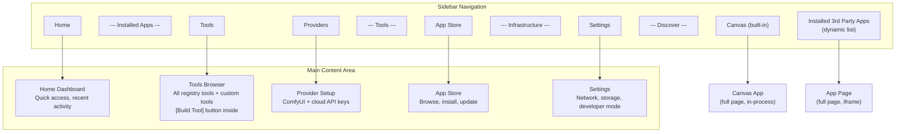
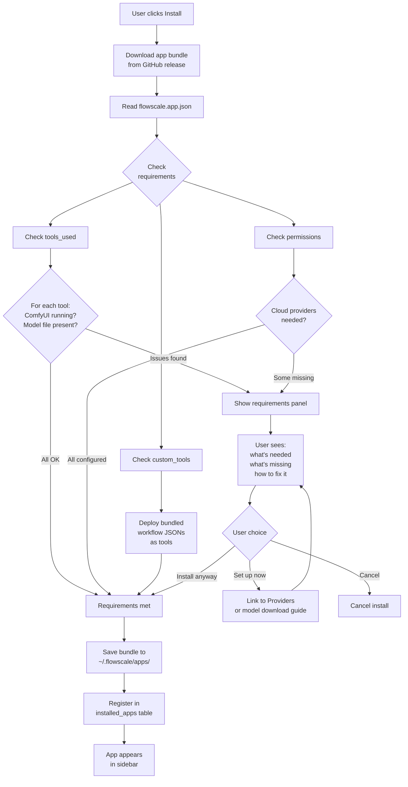
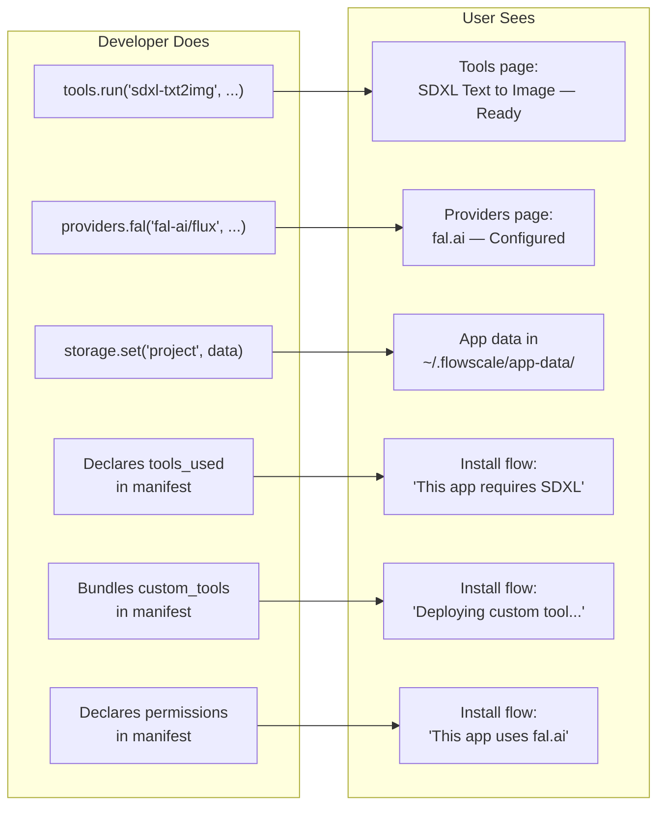

# FlowScale MVP App UX

> What the user sees, and how it connects to what the developer builds.

---

## Overview



---

## Table of Contents

1. [What Changes from Today](#1-what-changes-from-today)
2. [Sidebar & Navigation](#2-sidebar--navigation)
3. [Home Page](#3-home-page)
4. [Tools Page](#4-tools-page)
5. [Providers Page](#5-providers-page)
6. [App Store (Explore)](#6-app-store-explore)
7. [Installed App Pages](#7-installed-app-pages)
8. [Settings Page](#8-settings-page)
9. [Install Flow UX](#9-install-flow-ux)
10. [How User UX Maps to Developer UX](#10-how-user-ux-maps-to-developer-ux)

---

## 1. What Changes from Today

| Current | MVP | Why |
|---------|-----|-----|
| **Apps page** shows production tools in a grid | **Home page** shows installed apps (Canvas + third-party) and recent activity | Tools and apps are different things now. Tools are building blocks. Apps are what users interact with. |
| **Explore page** shows "coming soon" apps as static cards | **App Store** — browse and install real apps from the registry | This becomes functional, not placeholder. |
| **Integrations page** shows ComfyUI + "coming soon" providers | **Providers page** — configure ComfyUI connection + cloud provider API keys (fal.ai, Replicate, OpenRouter, HuggingFace) | "Integrations" was vague. These are providers — sources of inference. Users need to configure API keys here. |
| **Sidebar** has fixed navigation items | **Sidebar** has a dynamic "Installed Apps" section that grows as users install apps | Third-party apps need to appear somewhere. They appear in the sidebar like first-class citizens. |
| **No Tools browser** | **Tools page** — browse all officially launched registry tools + custom tools. Each tool shows installed/not-installed status. Install button to download required models. "Build Tool" button inside this page opens the existing ComfyUI workflow wizard. | This is the central hub for all AI capabilities. Users install tools here, developers browse schemas here. |
| **Settings** shows basic info | **Settings** includes Developer Mode with sideloading | Developers need a way to load apps from local paths. |

---

## 2. Sidebar & Navigation

### Current sidebar

```
- Explore
- Apps
- Assets
- Integrations
- Users (admin)
- Settings
```

### MVP sidebar

```
- Home

  APPS
- Canvas
- [Installed App 1]          (dynamic, appears after install)
- [Installed App 2]          (dynamic)
- ...

  TOOLS
- Tools                      (includes Build Tool button inside)

  INFRASTRUCTURE
- Providers

  DISCOVER
- App Store

- Settings
```

### Key changes

1. **Dynamic apps section.** When a user installs "AI Storyboard" from the App Store, it appears in the sidebar under APPS, right below Canvas. Clicking it loads the app in the main content area (in an iframe).

2. **Sections with labels.** The sidebar groups items into labeled sections: APPS, TOOLS, INFRASTRUCTURE, DISCOVER. This creates a clear hierarchy.

3. **"Integrations" becomes "Providers."** More specific. The user configures ComfyUI and cloud API keys here. ComfyUI is listed as a provider alongside fal.ai, Replicate, etc.

4. **"Explore" becomes "App Store."** Clearer purpose.

5. **Assets/Outputs page stays** but is secondary. It can remain as-is — it shows output files from tool runs. Not a major change for MVP.

---

## 3. Home Page

**Replaces:** current Apps page (`/apps`)

### What it shows

```
+------------------------------------------------------------------+
|  Welcome to FlowScale                                            |
|                                                                  |
|  QUICK ACCESS                                                    |
|  +----------+  +----------+  +----------+  +----------+          |
|  | Canvas   |  | AI Story |  | Concept  |  | + Install|          |
|  | (built-  |  | board    |  | Explorer |  |   More   |          |
|  |  in)     |  | (3rd pty)|  | (3rd pty)|  |          |          |
|  +----------+  +----------+  +----------+  +----------+          |
|                                                                  |
|  RECENT ACTIVITY                                                 |
|  - Generated 3 images with SDXL Text to Image           2m ago   |
|  - Opened Canvas "Product Shoot"                         1h ago   |
|  - Installed "AI Storyboard"                             3h ago   |
|                                                                  |
|  SYSTEM STATUS                                                   |
|  ComfyUI: Connected (port 6188)    fal.ai: Configured            |
|  SDXL: Available                   OpenRouter: Not set up         |
+------------------------------------------------------------------+
```

### Sections

1. **Quick Access** — Grid of installed apps (same visual style as current apps grid). Canvas is always first. The last card is "+ Install More" linking to the App Store.

2. **Recent Activity** — Last 5-10 actions across all apps and tools. Shows what happened, which app/tool, and when. Gives a sense of life to the dashboard.

3. **System Status** — At-a-glance view of infrastructure: is ComfyUI running? Which providers are configured? Which registry tools are ready (models present)? This is where the user first notices "OpenRouter: Not set up" and goes to Providers to fix it.

---

## 4. Tools Page

**New page.** This is the central hub for all AI tools in FlowScale.

It lists every tool that FlowScale has officially launched in the registry — all of them, not just the ones the user has set up. Each tool shows whether it's **installed** (required models downloaded) or **not installed**. Users can install tools directly from here. There's also a "Build Tool" button for creating custom tools from ComfyUI workflows.

### What it shows

```
+------------------------------------------------------------------+
|  Tools                                            [Build Tool]    |
|                                                                  |
|  [All] [Image] [Video] [3D] [Audio] [Upscale]     [Search...]    |
|                                                                  |
|  ALL TOOLS                                                       |
|  +--------------------+  +--------------------+  +------------+  |
|  | SDXL Text to Image |  | Flux Dev Txt2Img   |  | Remove     |  |
|  | image-generation   |  | image-generation   |  | Background |  |
|  |                    |  |                    |  |            |  |
|  | [Installed]        |  | [Install]          |  | [Installed]|  |
|  +--------------------+  +--------------------+  +------------+  |
|  +--------------------+  +--------------------+  +------------+  |
|  | Depth Anything V2  |  | SDXL Img2Img       |  | RealESRGAN |  |
|  | depth-estimation   |  | image-generation   |  | upscale    |  |
|  |                    |  |                    |  |            |  |
|  | [Install]          |  | [Install]          |  | [Installed]|  |
|  +--------------------+  +--------------------+  +------------+  |
|                                                                  |
|  CUSTOM TOOLS (built by you)                                     |
|  +--------------------+  +--------------------+                  |
|  | My Style Transfer  |  | Product Photo BG   |                  |
|  | custom             |  | custom              |                  |
|  | [Ready]            |  | [Ready]             |                  |
|  +--------------------+  +--------------------+                  |
+------------------------------------------------------------------+
```

### Tool card states

- **Installed** (green) — Required models are downloaded. Tool is ready to execute when ComfyUI is running.
- **Install** (button) — Models not yet downloaded. Clicking "Install" downloads the required model files to the correct ComfyUI directories.
- **Installing...** (progress) — Models are currently downloading. Shows download progress.

### What "Install" means for a tool

A tool is just a pre-configured ComfyUI workflow + a schema. "Installing" a tool means downloading the model files it needs:

```
User clicks [Install] on "Flux Dev Txt2Img"
        |
        v
  Show what will be downloaded:
    - flux1-dev.safetensors (12.1 GB)
    - ae.safetensors (335 MB)
    - clip_l.safetensors (246 MB)
    Destination: ComfyUI/models/checkpoints/
        |
        v
  User confirms → download begins → progress bar → done
        |
        v
  Card flips to [Installed]
```

### Tool detail view (clicking on a tool card)

```
+------------------------------------------------------------------+
|  SDXL Text to Image                                  [Installed]  |
|  Generate images from text prompts using Stable Diffusion XL.    |
|                                                                  |
|  INPUTS                                                          |
|  prompt         string    required     "Text description..."     |
|  negative_prompt string   optional     ""                        |
|  width          number    optional     1024                      |
|  height         number    optional     1024                      |
|  seed           number    optional     -1 (random)               |
|  steps          number    optional     20 (range: 1-50)          |
|  cfg_scale      number    optional     7  (range: 1-20)          |
|                                                                  |
|  OUTPUTS                                                         |
|  images         image[]                                          |
|  seed           number                                           |
|                                                                  |
|  REQUIREMENTS                                                    |
|  Model: sd_xl_base_1.0.safetensors    [Downloaded]               |
|  Custom nodes: none                                              |
|                                                                  |
|  USED BY                                                         |
|  - Concept Explorer (installed app)                              |
|  - Canvas (built-in)                                             |
+------------------------------------------------------------------+
```

This is the user-facing version of what the developer sees via `tools.get(toolId)`. Same information, presented in a UI.

### The "Build Tool" button

Clicking "Build Tool" opens the existing 4-step wizard (Attach → Configure → Test → Deploy). Right now there is one method: the ComfyUI workflow process. The user either uploads a ComfyUI workflow JSON or picks one from their ComfyUI instance, then the wizard auto-configures it as a tool. Once deployed, the custom tool appears back on this page under "Custom Tools."

### Why this page matters

1. **Users browse everything available.** All officially launched FlowScale tools are listed. Users can install whichever ones they want.
2. **Install is simple.** Click Install → confirm model download → done. No manual file management.
3. **Developers browse schemas.** During development, they come here to see tool IDs, input names, types, and defaults. This is their API documentation in a living UI.
4. **Custom tools are visible.** Tools built via Build Tool show up here alongside registry tools.

---

## 5. Providers Page

**Replaces:** current Integrations page (`/integrations`)

### What it shows

```
+------------------------------------------------------------------+
|  Providers                                                       |
|  Configure your AI inference sources.                            |
|                                                                  |
|  LOCAL INFERENCE                                                 |
|  +--------------------------------------------------------------+
|  | ComfyUI                                        [Connected]   |
|  | Running on port 6188                                         |
|  | VRAM: 12GB (RTX 4070)  |  Models: 8 found                   |
|  | [View Details]                                               |
|  +--------------------------------------------------------------+
|                                                                  |
|  CLOUD PROVIDERS                                                 |
|  +--------------------------------------------------------------+
|  | fal.ai                                         [Configured]  |
|  | API Key: sk-****...****7f2a                                  |
|  | [Test Connection]  [Remove]                                  |
|  +--------------------------------------------------------------+
|  | OpenRouter                                     [Configured]  |
|  | API Key: sk-****...****3e1b                                  |
|  | [Test Connection]  [Remove]                                  |
|  +--------------------------------------------------------------+
|  | Replicate                                   [Not configured] |
|  | Cloud inference for image, video, audio models.              |
|  | [Add API Key]                                                |
|  +--------------------------------------------------------------+
|  | HuggingFace                                 [Not configured] |
|  | Access HuggingFace Inference API.                            |
|  | [Add API Key]                                                |
|  +--------------------------------------------------------------+
+------------------------------------------------------------------+
```

### Key behaviors

1. **ComfyUI section** links to the existing ComfyUI detail page (`/comfyui`) with version info, models, custom nodes, logs.

2. **Cloud provider cards** have three states:
   - **Not configured** — shows description + "Add API Key" button
   - **Configured** — shows masked API key + "Test Connection" and "Remove" buttons
   - **Error** — key is set but test failed (invalid key, provider down)

3. **"Test Connection"** makes a lightweight API call to the provider to verify the key works. Shows success/error inline.

4. **API keys are stored in FlowScale settings** (SQLite), never exposed to apps. When an app calls `providers.fal(...)`, the host injects the key into the request.

### Why this matters for developers

When a developer's app calls `providers.fal(...)` and the user hasn't configured fal.ai, the app gets a `PROVIDER_NOT_CONFIGURED` error. The developer shows a message like "This feature requires fal.ai. Set it up in Providers." The user goes to Providers, adds the key, and the feature works.

The Providers page is the user-side resolution for every `PROVIDER_NOT_CONFIGURED` error a developer might encounter.

---

## 6. App Store (Explore)

**Replaces:** current Explore page (`/explore`)

### What it shows

```
+------------------------------------------------------------------+
|  App Store                                        [Search...]    |
|                                                                  |
|  FEATURED                                                        |
|  +----------------------+  +----------------------+              |
|  | AI Storyboard        |  | Concept Explorer     |              |
|  | [screenshot]         |  | [screenshot]         |              |
|  | Studio X             |  | FlowScale            |              |
|  | Create storyboards   |  | Compare AI models    |              |
|  | for film and video.  |  | side by side.        |              |
|  |                      |  |                      |              |
|  | Requires:            |  | Requires:            |              |
|  |  ComfyUI + SDXL      |  |  ComfyUI + SDXL      |              |
|  |  fal.ai (optional)   |  |  fal.ai (optional)   |              |
|  |                      |  |                      |              |
|  | [Install]            |  | [Install]            |              |
|  +----------------------+  +----------------------+              |
|                                                                  |
|  CATEGORIES                                                      |
|  [All] [Image] [Video] [3D] [Audio] [Text] [Pipeline]           |
|                                                                  |
|  ALL APPS                                                        |
|  +----------------------+  +----------------------+  +---------+ |
|  | AI Compositor        |  | Product Shooter      |  | ...     | |
|  | ...                  |  | ...                  |  |         | |
|  +----------------------+  +----------------------+  +---------+ |
+------------------------------------------------------------------+
```

### App card anatomy

```
+----------------------------------+
|  [App Icon]  AI Storyboard  v1.2 |
|                                  |
|  [Screenshot/Preview]            |
|                                  |
|  By Studio X                     |
|  Create AI-powered storyboards   |
|  for film and video production.  |
|                                  |
|  Requires:                       |
|    Tools: SDXL, Remove BG        |
|    Providers: fal.ai (optional)  |
|                                  |
|  [Install]    or    [Installed ✓]|
+----------------------------------+
```

The "Requires" section is critical. At a glance, the user knows what they need:
- **Tools** = which registry tools the app uses (and whether the user has the models for them)
- **Providers** = which cloud providers the app might call

### App detail page (clicking on a card)

Full description, screenshots, permissions breakdown, requirements check, install button. This is where the install flow begins (see Section 10).

---

## 7. Installed App Pages

When a user clicks an installed third-party app in the sidebar, the main content area loads the app.

### How it works

```
User clicks "AI Storyboard" in sidebar
        |
        v
  Host creates an iframe:
  <iframe src="flowscale://app/ai-storyboard/index.html" />
        |
        v
  App loads, SDK auto-connects via postMessage bridge
        |
        v
  App renders its own UI inside the iframe
  (full width, full height of main content area)
```

The app occupies the entire main content area. No FlowScale chrome inside the app — just the sidebar on the left and the app filling the rest.

### App header bar

A thin bar at the top of the iframe area showing:

```
+------------------------------------------------------------------+
|  AI Storyboard  v1.2  |  by Studio X  |           [•••] Menu     |
+------------------------------------------------------------------+
|                                                                  |
|  [App's own UI fills this entire space]                          |
|                                                                  |
+------------------------------------------------------------------+
```

The menu (`•••`) offers:
- About this app
- Check for updates
- App permissions (what it can access)
- Uninstall

### Built-in apps vs third-party apps

From the user's perspective, Canvas and a third-party app look the same — a sidebar item that opens a full-page app. The only difference:
- Canvas has no "Uninstall" option in the menu
- Canvas renders in-process (no iframe), but this is invisible to the user

---

## 8. Settings Page

**Mostly the same** as today, with one addition:

### Developer Mode section

```
+------------------------------------------------------------------+
|  Settings                                                        |
|                                                                  |
|  NETWORK ACCESS                                                  |
|  Localhost: http://localhost:14173         [Copy]                 |
|  Network:  http://192.168.1.42:14173      [Copy]                 |
|                                                                  |
|  STORAGE                                                         |
|  Database: ~/.flowscale/aios.db                                  |
|  App data: ~/.flowscale/app-data/                                |
|  App bundles: ~/.flowscale/apps/                                 |
|                                                                  |
|  APP INFO                                                        |
|  Version: v0.2.0                                                 |
|                                                                  |
|  DEVELOPER MODE                                    [Toggle: Off] |
|  When enabled, shows developer tools for building                |
|  FlowScale apps.                                                 |
|                                                                  |
|  (When toggled ON:)                                              |
|  +--------------------------------------------------------------+|
|  | Sideload App                                                 ||
|  | Load an app from a local directory for testing.              ||
|  |                                                              ||
|  | Path: [~/my-app/dist/                        ] [Browse] [Load]|
|  |                                                              ||
|  | Currently sideloaded:                                        ||
|  |   my-app (from ~/my-app/dist/)          [Unload]             ||
|  +--------------------------------------------------------------+|
+------------------------------------------------------------------+
```

### How sideloading works

1. Developer toggles on Developer Mode.
2. Clicks "Browse" or types a path to their app's `dist/` directory.
3. Clicks "Load."
4. FlowScale reads `flowscale.app.json` from the parent directory of `dist/`.
5. Validates the manifest.
6. App appears in the sidebar under APPS (with a "DEV" badge).
7. Developer clicks it — app loads in an iframe, same as any installed app.
8. To reload after rebuilding: click "Unload" then "Load" again (or refresh the app page).

---

## 9. Install Flow UX

What happens when a user clicks "Install" on an app in the App Store.

### Flow



### The requirements panel

```
+------------------------------------------------------------------+
|  Install "AI Storyboard"                                         |
|                                                                  |
|  REQUIREMENTS CHECK                                              |
|                                                                  |
|  Tools:                                                          |
|    [✓] SDXL Text to Image        Ready                           |
|    [✓] Remove Background         Ready                           |
|    [✗] Depth Anything V2         Model not found                 |
|        Need: depth_anything_v2.safetensors                       |
|        Place in: ComfyUI/models/checkpoints/                     |
|                                                                  |
|  Providers:                                                      |
|    [✓] fal.ai                    Configured                      |
|    [—] OpenRouter                Not configured (optional)       |
|                                                                  |
|  Custom nodes:                                                   |
|    [✓] ComfyUI Impact Pack      Installed                        |
|    [✗] WAS Node Suite            Not installed                   |
|        Install via ComfyUI Manager                               |
|                                                                  |
|  Bundled tools:                                                  |
|    [+] custom-depth-composite    Will be auto-deployed            |
|                                                                  |
|  [Cancel]                         [Install Anyway]  [Set Up Now] |
+------------------------------------------------------------------+
```

"Install Anyway" proceeds with missing dependencies — the app will work partially, and tools that can't run will return clear errors. "Set Up Now" links to the relevant setup page (Providers for API keys, or guidance for model downloads).

---

## 10. How User UX Maps to Developer UX

This is the bridge between what the developer builds and what the user experiences.



### The mapping in detail

| Developer action | User-facing consequence |
|-----------------|------------------------|
| `tools.run('sdxl-txt2img', {...})` | User needs ComfyUI running + SDXL model. Visible on **Tools page** with ready/missing status. |
| `tools.run('my-custom-tool', {...})` | If tool is in `custom_tools` manifest, it's auto-deployed on install. If not, user sees `TOOL_NOT_FOUND` error. |
| `providers.fal('fal-ai/flux', {...})` | User needs fal.ai API key. Visible on **Providers page**. If missing, app shows "configure fal.ai in Providers." |
| `providers.openrouter('claude-3.5', {...})` | Same pattern. User configures in Providers. |
| `storage.set(key, value)` | Data stored in SQLite, scoped to app. User doesn't see this directly. Cleared on uninstall. |
| `storage.files.write(path, blob)` | File saved in `~/.flowscale/app-data/{app-id}/`. User could find it on disk but normally doesn't need to. |
| `ui.showNotification({...})` | Notification appears in FlowScale's host notification system (consistent look, not app-specific). |
| `ui.confirm({...})` | Confirmation dialog appears as a host-level modal (consistent look). |
| `tools_used` in manifest | Drives the **install flow** requirements check. User sees which tools are needed and whether they're ready. |
| `permissions` in manifest | Drives the **install flow** permissions display. User sees "This app uses fal.ai" before installing. |
| `custom_tools` in manifest | Bundled workflows are auto-deployed as tools during install. User sees "Deploying custom tool..." |

### Error messages and where they resolve

| SDK error | What user sees | Where to fix |
|-----------|---------------|--------------|
| `EXECUTION_ENGINE_UNAVAILABLE` | "ComfyUI is not running" | Start ComfyUI, check **Providers > ComfyUI** |
| `MODEL_NOT_FOUND` | "Model X not found" | Download model, place in ComfyUI dirs, check **Tools page** |
| `TOOL_NOT_FOUND` | "Tool X not found" | Developer bug (forgot to bundle tool) or tool was deleted |
| `PROVIDER_NOT_CONFIGURED` | "fal.ai not set up" | Go to **Providers**, add API key |
| `PROVIDER_ERROR` | "fal.ai returned an error" | Check API key validity, rate limits, provider status |
| `PERMISSION_DENIED` | "App doesn't have permission for X" | Developer bug (forgot to declare permission in manifest) |

### The virtuous cycle

```
Developer builds app
  → Declares tools + providers in manifest
  → User installs, sees exactly what's needed
  → User sets up infrastructure (models, API keys)
  → App works
  → If something breaks, error messages point to the right page
  → User fixes it
  → App works again
```

No guessing. No hidden dependencies. Every piece of infrastructure an app needs is declared, checked, and surfaced in the UI.

---

## Summary

The MVP app UX changes distill to:

1. **Home** — installed apps + activity, replaces the tools grid
2. **Tools** — new page, lists all officially launched registry tools with installed/not-installed status. Users install tools (download models) directly here. "Build Tool" button inside opens the ComfyUI workflow wizard for custom tools.
3. **Providers** — replaces Integrations, lists ComfyUI alongside cloud providers (fal.ai, Replicate, OpenRouter, HuggingFace)
4. **App Store** — replaces Explore, browse and install real apps
5. **Sidebar** — dynamic installed apps section, TOOLS section (not BUILD)
6. **Settings** — add Developer Mode with sideloading
7. **Install flow** — dependency checks with clear resolution paths

Every user-facing element maps directly to something the developer declared in their app's manifest or called in the SDK. The user never encounters a mystery error — every failure points to a specific page where they can fix it.
